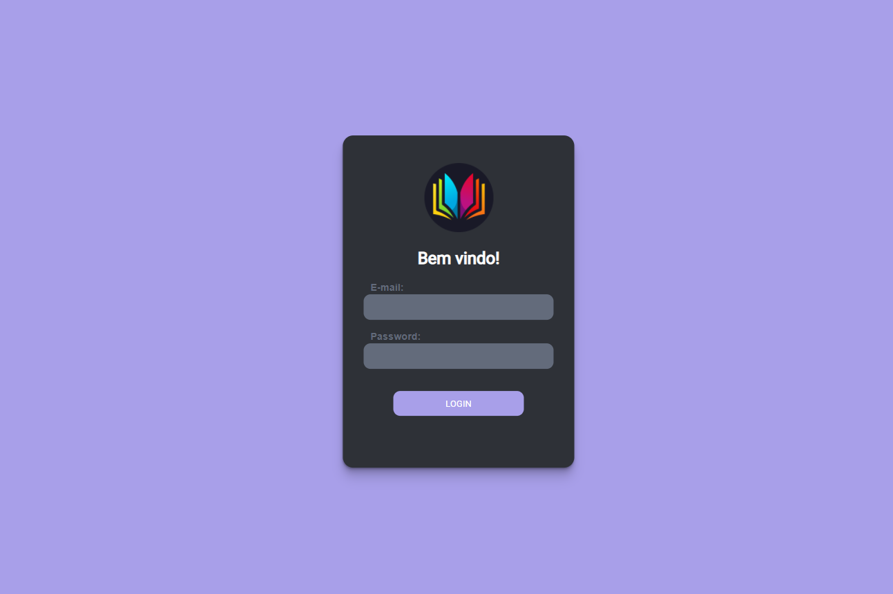
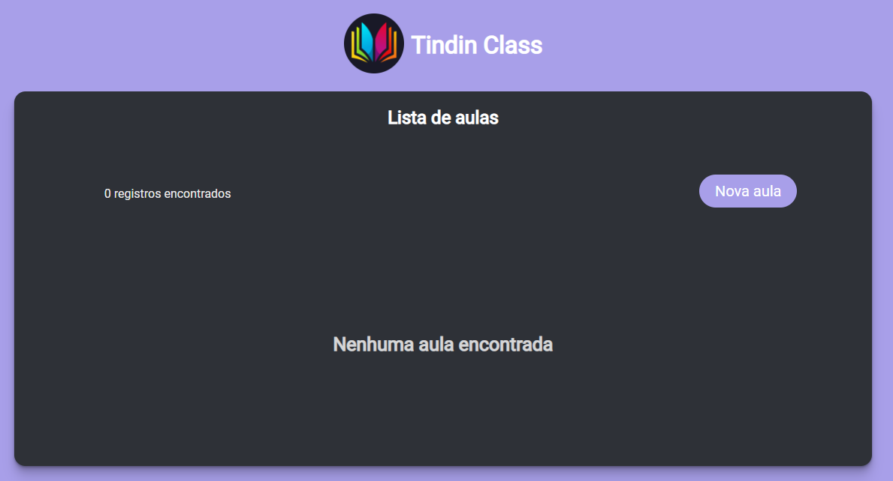
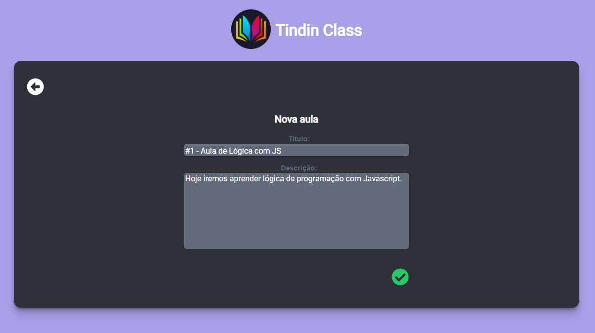
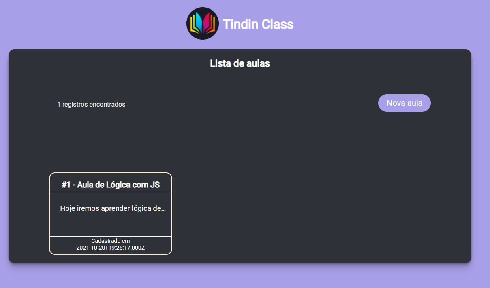
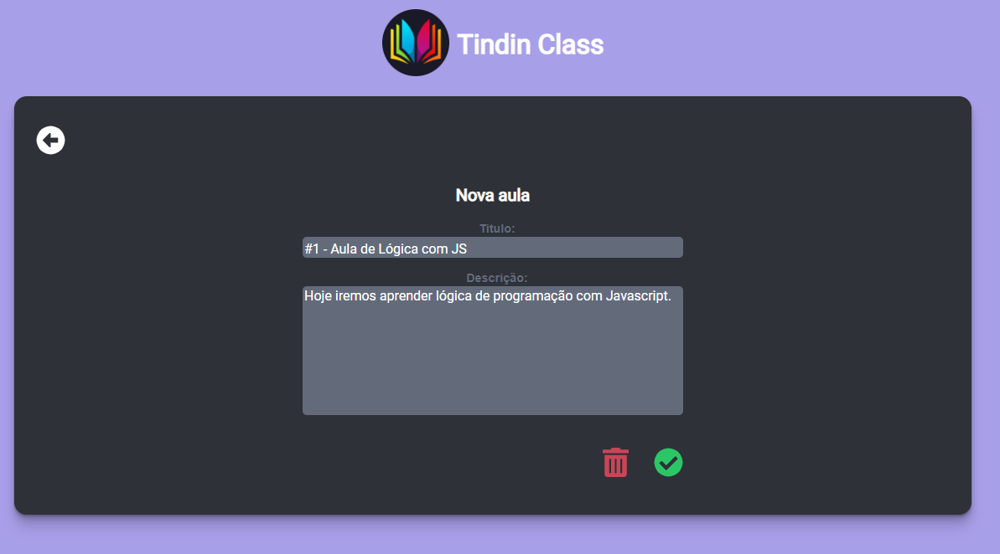

# API - Cadastro de Aulas

### Para começar, digite no terminal:
 ``` 
npm start 
 ```

### Acesse:
```
http://localhost:4200
```

### **Importante:**
- Certifique-se que a api também esteja rodando para que tudo funcione perfeitamente.
- Para utilizar o login e entrar na aplicação, utilize a rota do backend abaixo, dessa forma você irá inserir um novo usuário no banco com o seus dados:
<br>

  - **criar** -> *(POST)*
    - route: **/user/register**
    - *Body(JSON)*
    ```
      { "email": "ronaldo@mail.com", "password": "12345678"}
    ``` 

- Depois, basta colocar seu e-mail e senha na interface de login, cofirmar e ver a mágica acontecer.

---

<p align="center">
  Tela de login
  
</p>
<p align="center">
  Tela home, vazia
  
</p>

<p align="center">
  Tela de criação de uma nova aula
  
</p>

<p align="center">
  Tela home, com aula
  
</p>

<p align="center">
  Tela de edição/remoção de aula existente
  
</p>


---

#### **Os requisitos:**
- **[x]** O frontend deve possibilitar que o usuario entre com uma conta; pré-cadastrada no banco de dados.
- **[x]** O frontend deve validar se o usuario ja esta logado na aplicação e redirecionar o usuario para a pagina correta em caso de refresh ou navegador fechado.
- **[x]** O frontend deve permitir que o usuario ja logado na aplicação deslogue da aplicação.
- **[x]** O frontend deve apresentar para o usuário a listagem de aulas cadastradas.
- **[x]** O frontend deve permitir a criação de uma nova aula.
- **[x]** O frontend deve permitir a edição de uma aula cadastrada.
- **[x]** O frontend deve permitir a remoção de uma aula cadastrada.

---
