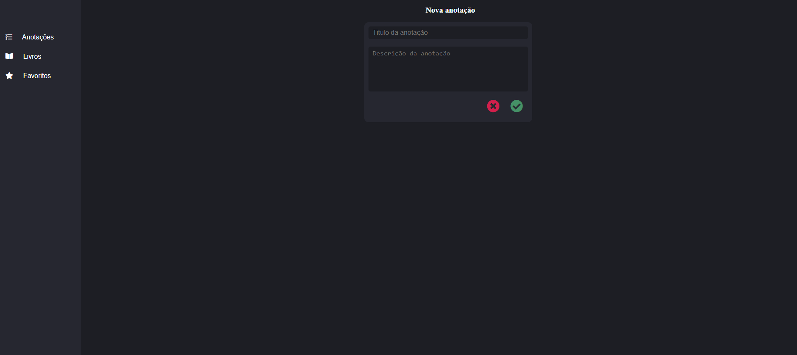

# Tela da aplicação 



Em **entendendo o backend** utilize:
``` npm start ```

#### **Desafio:** melhorar o app de cadastro de anotações

- [x] Implementar estilo na página;
- [x] Adicionar proporções dinâmicas na página;
- [x] Simulação básica (Conceito de atualização em tempo real do html) de Single Page Application;
- [x] Listagem de cards favoritos em tempo real;
- [x] Remoção e adição dos livros;

###### É simples mas é de coração.
