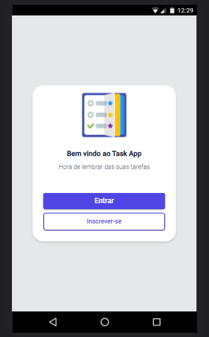
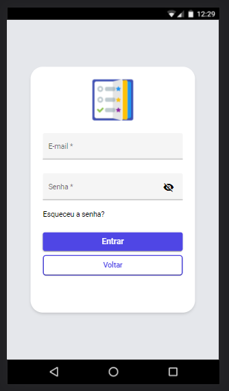
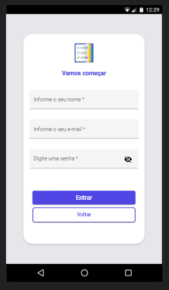
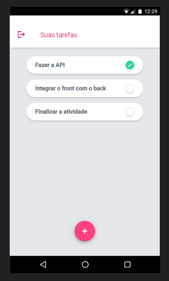
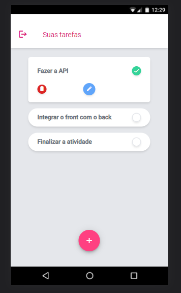
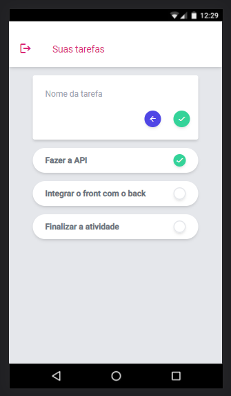

# Atividade #3 - Cadastro de tarefas

### Para começar, digite no terminal:
 ``` 
npm start 
 ```

### Acesse:
```
http://localhost:4200/
```

### **Rotas:**

- /auth
- /tasks


### **Importante:**
- Certifique-se que a api também esteja rodando para que tudo funcione perfeitamente.
---

<br>

<p align="center">
  Tela de bem vindo
  <br>
  
</p>
<p align="center">
  Tela de login
  <br>
  
</p>

<p align="center">
  Tela de cadastro
  <br>
  
</p>

<p align="center">
  Tela de tarefas
  <br>
  
</p>

<p align="center">
  Editar ou remover tarefa
  <br>
  
</p>

<p align="center">
  Criar tarefa
  <br>
  
</p>

---

#### **Os requisitos:**
- **[x]** O frontend deve possibilitar que o usuario entre com uma conta existente.
- **[x]** O frontend deve possibilitar que o usuario crie uma nova conta.
- **[x]** O frontend deve permitir que o usuario ja logado na aplicação deslogue da aplicação.
- **[]** O frontend deve possibilitar que o usuario recupere a sua conta.
- **[x]** O frontend deve validar se o usuario ja esta logado na aplicação e redirecionar o usuario para a pagina correta em caso de refresh.
- **[x]** O frontend deve apresentar para o usuário a listagem de tarefas cadastradas.
- **[]** O frontend deve permitir a criação de uma nova tarefa.
- **[]** O frontend deve permitir a edição de uma tarefa cadastrada.
- **[]** O frontend deve permitir a remoção de uma tarefa cadastrada.

---
