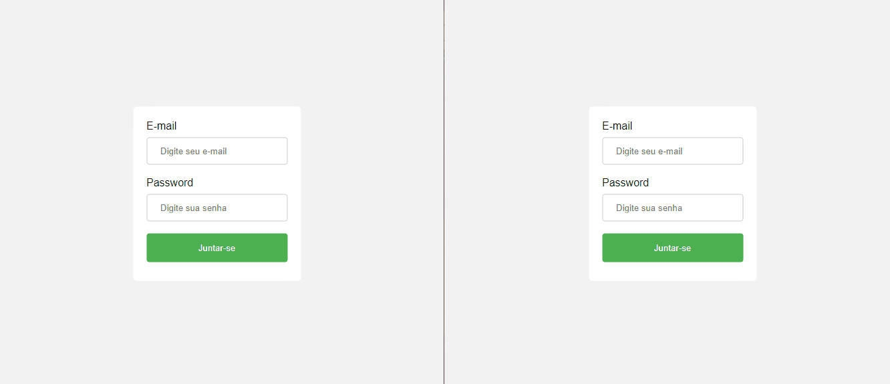

# Semana 4 - Chat

 

  Chat App
   
  

---

 A aplicação deve:

- [x] Permitir que o usuario realize o login.
- [x] Listar os usuarios conectados no chat.
- [x] Permitir que o usuario visualize as mensagens mais recentes.
- [x] Permitir que o usuario envie uma mensagem no chat.
- [x] Desconectar os usuarios da lista do chat.
- [x] Possuir paginação (ultimas 20 mensagens mais recente com data e horario).
- [x] O backend deve salvar a mensagem no banco e emitir a mensagem para os outros usuarios.
