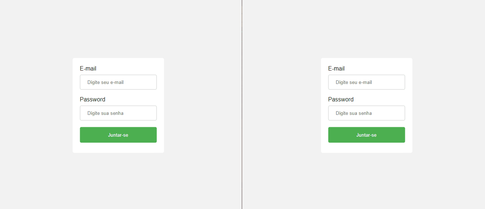

# Semana 4 - Chat

<br>

<p align="center">
  Chat App
  <br>
  
</p>

---

- Os usuários do gif acima foram cadastrados no banco de dados com o uso do Postman.
- Rota: 
  - **registrar** -> *(POST)*
    - route: **/register** 
    - *Body(JSON)*
    ```
      { "name": "username", "email": "user@mail.com", "password": "123" }
    ``` 

    <br>

 ## A aplicação deve:

- [x] Permitir que o usuario realize o login.
- [x] Listar os usuarios conectados no chat.
- [x] Permitir que o usuario visualize as mensagens mais recentes.
- [x] Permitir que o usuario envie uma mensagem no chat.
- [x] Desconectar os usuarios da lista do chat.
- [x] Possuir paginação (ultimas 20 mensagens mais recente com data e horario).
- [x] Salvar a mensagem no banco e emitir a mensagem para os outros usuarios.
- [ ] Permitir que o usuario envie uma imagem no chat

---

### **TEMPLATE:**
- [Template-usando-nodejs+express+typescript+mongodb](https://github.com/fabiotindin/template-node-ts-mongodb)
