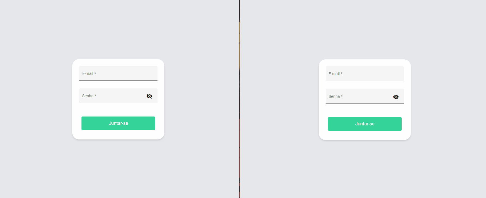

# Semana 4 - Chat

### Para começar, digite no terminal:
 ``` 
npm start 
 ```

Acesse: http://localhost:4200/

<p align="center">
  Chat App
  <br>
  
</p>

<br>

 ## A aplicação deve:

- [x] Permitir que o usuario realize o login.
- [x] Listar e atualizar os usuarios conectados no chat.
- [x] Permitir que o usuario visualize as mensagens mais recentes.
- [x] Permitir que o usuario envie uma mensagem no chat.
- [x] Possuir paginação (ultimas 20 mensagens mais recente com data e horario).
- [x] Salvar a mensagem no banco e emitir a mensagem para os outros usuarios.
- [x] Permitir o logout de um usuario e emitir a desconexão do mesmo para os usuarios conectados.
- [x] Permitir que o usuario envie uma imagem no chat

---

### **TEMPLATE:**
- [Template-usando-nodejs+express+typescript+mongodb](https://github.com/fabiotindin/template-node-ts-mongodb)
